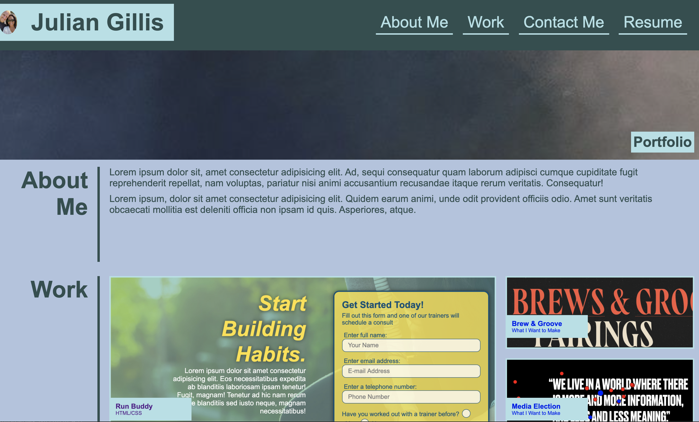

<!-- PROJECT LOGO -->
<br />
<p align="center">
  <a href="https://github.com/Calterat/Portfolio">
    
  </a>

  <h1 align="center">My Portfolio</h1>

  <p align="center">
    Julian Gillis' Portfolio
    <br />
    <a href="https://github.com/Calterat/Portfolio"><strong>Explore the docs »</strong></a>
    <br />
    <br />
    <a href="https://calterat.github.io/Portfolio/">View Demo</a>
  </p>
</p>
<br/>

<!-- TABLE OF CONTENTS -->
## Table of Contents

* [About the Project](#about-the-project)
  * [Built With](#built-with)
* [Getting Started](#getting-started)
  * [Prerequisites](#prerequisites)
  * [Installation](#installation)
* [Usage](#usage)
* [Roadmap](#roadmap)
* [Contributing](#contributing)
* [License](#license)
* [Contact](#contact)
* [Acknowledgements](#acknowledgements)


<!-- ABOUT THE PROJECT -->
## About The Project



Here's a quick screenshot of my portfolio page.

This is my Portfolio and Resume. This displays my abilities with HTML and CSS front-end development. The page displays my other projects as well with links to visit them.


### Built With

* [HTML]()
* [CSS]()
* [VSCODE]()


<!-- GETTING STARTED -->
## Getting Started

To get a local copy of the source code these simple steps.

### Prerequisites

These are the tools you'll need if locally editing the source code.
* Git Bash (if using Windows)
    * https://gitforwindows.org (for Windows)
* Terminal (built into MacOS)
* VSCode or comparible text/code editor
    * https://code.visualstudio.com

### Installation

1. Clone the repo (type in Bash or Terminal)
```
git clone git@github.com:Calterat/Portfolio.git
```


<!-- USAGE EXAMPLES -->
## Usage

[My Portfolio](https://calterat.github.io/Portfolio/)

Please review and navigate to assess my skills as a front-end web developer.


<!-- ROADMAP -->
## Roadmap

See the [open issues](https://github.com/Calterat/Portfolio/issues) for a list of proposed features (and known issues).


<!-- Suggestions -->
## Suggestions

Suggestions are welcomed. I love to learn, to create, and be inspired. Any suggestions/features you suggest are **greatly appreciated**.

1. Fork the Project
2. Create your Feature Branch (`git checkout -b feature/suggestions`)
3. Commit your Changes (`git commit -m 'Created Suggestion'`)
4. Push to the Branch (`git push origin feature/suggestions`)
5. Open a Pull Request


<!-- LICENSE -->
## License

Distributed under the MIT License. See `LICENSE` for more information.


<!-- CONTACT -->
## Contact

Julian Gillis -  Calterat@gmail.com

Project Link: [https://github.com/Calterat/Portfolio](https://github.com/Calterat/Portfolio)


<!-- Additional Notes -->
## Additional Notes

My Facebook page is currently not public, but check the link later! It will be back up soon!

Thank you for taking the time to check out my Portfolio!


<!-- ACKNOWLEDGEMENTS -->
## Acknowledgements

* [All instructors who helped with my teachings]()
* [Othneil Drew](#https://github.com/othneildrew)
    * How to - README.md templates


<!-- MARKDOWN LINKS & IMAGES -->
<!--

[GitHub Repository]: https://github.com/Calterat/Portfolio
[Portfolio URL]: https://calterat.github.io/Portfolio/
[issues-url]: https://github.com/Calterat/Portfolio/issues
[license-url]: https://github.com/Calterat/Portfolio/blob/master/LICENSE.txt
[linkedin-url]: https://www.linkedin.com/in/julian-gillis-5ba18b20/


-->